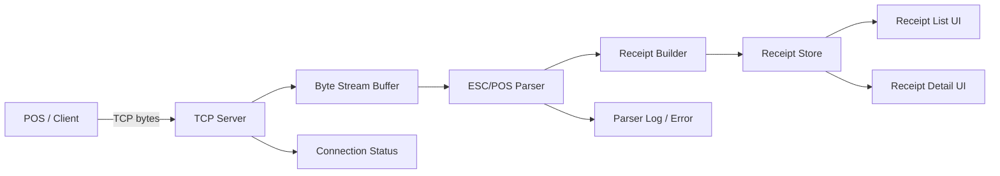

# Android ESC/POS Virtual Printer 상세 설계

## 0. 조사 근거

이 문서는 ESC/POS 명령 체계, Android 백그라운드 실행 제약, React Native Native Module 구조를 기준으로 설계했다.

참고한 주요 공식 문서:

- Epson ESC/POS Command Reference: ESC/POS 명령 목록은 출력, 문자, 위치, 용지 컷, 비트 이미지, 바코드, 2D 코드 등 기능별로 분류되어 있으며, 모델별 지원 명령 차이가 있다.  
  https://download4.epson.biz/sec_pubs/pos/reference_en/escpos/commands.html
- Epson ESC/POS 개별 명령 문서: Epson 명령 문서는 ASCII, Hex, Decimal 포맷과 파라미터 범위, 명령별 주의사항을 제공한다. 예를 들어 `GS ( L` 계열 그래픽 명령은 길이 필드와 기능 번호를 포함한다.  
  https://download4.epson.biz/sec_pubs/pos/reference_en/escpos/gs_lparen_cl_fn82.html
- Android Foreground Services: 장시간 사용자 인지 작업은 foreground service로 실행하고 상태바 알림을 표시해야 한다.  
  https://developer.android.com/develop/background-work/services/fgs
- Android 12 이상 백그라운드 시작 제한: Android 12/API 31 이상 타깃 앱은 백그라운드에서 foreground service를 시작할 수 없는 경우가 많다. 앱 UI에서 사용자가 서버 시작을 명시적으로 수행하는 흐름이 안전하다.  
  https://developer.android.com/develop/background-work/services/fgs/restrictions-bg-start
- Android 14 foreground service type 요구사항: Android 14 타깃 앱은 foreground service type과 관련 권한 선언이 필요하다. 이 앱의 장시간 TCP 서버는 `specialUse` 또는 정책에 맞는 서비스 타입 검토가 필요하다.  
  https://developer.android.com/about/versions/14/changes/fgs-types-required
- React Native Turbo Native Modules: React Native에서 플랫폼 API가 필요하면 TypeScript/Flow 명세와 Codegen을 통해 Turbo Native Module을 작성하는 구조가 권장된다.  
  https://reactnative.dev/docs/turbo-native-modules-introduction
- Microsoft ESC/POS formatting 설명: 일반 텍스트와 ESC/GS 계열 제어 명령이 섞여 전송되는 특성을 설명한다.  
  https://learn.microsoft.com/en-us/windows/apps/develop/devices-sensors/pos/epson-esc-pos-with-formatting

설계상 중요한 결론:

- TCP는 메시지 경계가 없는 바이트 스트림이므로 ESC/POS 파서는 chunk 단위가 아니라 누적 버퍼와 상태 머신으로 구현해야 한다.
- ESC/POS는 모델별 명령 차이와 제조사 확장 명령이 많으므로, 알 수 없는 명령을 치명 오류로 처리하지 말고 경고/로그로 보존해야 한다.
- Android에서 장시간 TCP 서버를 안정적으로 유지하려면 Foreground Service가 필요하다.
- React Native를 선택하더라도 TCP 서버, foreground service, 고빈도 바이트 파싱은 Android Native Module에 두는 구조가 가장 안정적이다.

## 1. 목표

TCP 소켓으로 수신한 ESC/POS 프린터 데이터를 파싱하여 Android 화면에 영수증 형태로 표시하는 가상 프린터 앱을 만든다.

앱은 다음 기능을 제공한다.

- TCP 서버 소켓을 열고 POS/클라이언트 장비의 연결을 수락한다.
- 수신된 바이트 스트림을 ESC/POS 명령어와 출력 텍스트/이미지 데이터로 파싱한다.
- 컷 명령, 폼 피드, 명시적 종료 조건 등을 기준으로 영수증 단위로 분리한다.
- 여러 영수증을 리스트로 보관하고 화면에서 스크롤하여 확인할 수 있다.
- 프린터 상태, 포트, 연결 상태, 수신 로그, 파싱 오류를 확인할 수 있다.
- 네이티브 Android 또는 React Native 방식으로 구현할 수 있도록 아키텍처를 분리한다.

## 2. 범위

### 2.1 1차 지원 범위

- TCP 서버
  - 포트 설정
  - 시작/중지
  - 단일 또는 다중 클라이언트 연결
  - 백그라운드 수신
- ESC/POS 파싱
  - 텍스트 출력
  - 줄바꿈
  - 정렬
  - 굵게
  - 밑줄
  - 글자 크기
  - 컷 명령
  - 초기화 명령
  - 코드페이지 또는 UTF-8 기반 텍스트 디코딩
- 화면 표시
  - 영수증 목록
  - 영수증 상세
  - 수신 시간, 클라이언트 주소, 바이트 수 표시
  - 긴 영수증 스크롤
- 데이터 관리
  - 메모리 저장
  - 최근 N개 영수증 유지
  - 앱 종료 시 삭제 또는 로컬 저장 옵션

### 2.2 후속 지원 범위

- 바코드/QR 코드 렌더링
- 래스터 이미지 출력 명령 렌더링
- 돈통 열림 명령, 부저 명령 등 이벤트 표시
- 프린터 상태 응답 명령 처리
- 영수증 검색
- PDF/이미지 내보내기
- 동일 네트워크에서 프린터 광고 또는 mDNS 지원

## 3. 전체 구조



핵심은 네트워크 수신, ESC/POS 파싱, 영수증 렌더링을 분리하는 것이다.

- `TCP Server`: 바이트 수신만 담당한다.
- `ESC/POS Parser`: 바이트 스트림을 명령어와 출력 토큰으로 변환한다.
- `Receipt Builder`: 토큰을 영수증 문서 모델로 누적한다.
- `Receipt Store`: 완성된 영수증과 진행 중 영수증을 관리한다.
- `UI`: 영수증 모델을 화면 컴포넌트로 렌더링한다.

## 4. 도메인 모델

### 4.1 Receipt

```kotlin
data class Receipt(
    val id: String,
    val createdAt: Instant,
    val completedAt: Instant?,
    val sourceHost: String?,
    val sourcePort: Int?,
    val byteCount: Long,
    val status: ReceiptStatus,
    val blocks: List<ReceiptBlock>,
    val rawDataRef: String? = null,
    val parseWarnings: List<ParseWarning> = emptyList()
)
```

### 4.2 ReceiptBlock

```kotlin
sealed interface ReceiptBlock {
    data class TextLine(
        val segments: List<TextSegment>,
        val align: TextAlign
    ) : ReceiptBlock

    data class Image(
        val width: Int,
        val height: Int,
        val bitmapRef: String
    ) : ReceiptBlock

    data class Barcode(
        val type: String,
        val value: String
    ) : ReceiptBlock

    data class Separator(
        val kind: String
    ) : ReceiptBlock

    data class DeviceEvent(
        val type: String,
        val payload: String?
    ) : ReceiptBlock
}
```

### 4.3 TextStyle

```kotlin
data class TextStyle(
    val bold: Boolean = false,
    val underline: Boolean = false,
    val inverse: Boolean = false,
    val widthScale: Int = 1,
    val heightScale: Int = 1,
    val codePage: String = "UTF-8"
)
```

React Native 구현에서도 동일한 구조를 TypeScript 타입으로 둔다.

```ts
type Receipt = {
  id: string;
  createdAt: string;
  completedAt?: string;
  sourceHost?: string;
  sourcePort?: number;
  byteCount: number;
  status: 'receiving' | 'completed' | 'error';
  blocks: ReceiptBlock[];
  parseWarnings: ParseWarning[];
};
```

## 5. ESC/POS 파서 설계

### 5.1 파서 입력/출력

입력은 TCP에서 받은 연속 바이트 스트림이다. TCP는 메시지 경계를 보장하지 않으므로, 파서는 부분 명령어와 부분 문자 데이터를 처리할 수 있어야 한다.

```text
ByteArray chunk -> ParserState -> List<ParserEvent>
```

예시 이벤트:

- `Text(bytes)`
- `LineFeed`
- `SetAlign(left|center|right)`
- `SetBold(enabled)`
- `SetUnderline(enabled)`
- `SetTextSize(width, height)`
- `PrintImage(bitmap)`
- `PrintBarcode(type, value)`
- `Cut`
- `Initialize`
- `UnknownCommand(bytes)`
- `NeedMoreBytes`

### 5.2 상태 기반 파싱

파서는 stateless 함수가 아니라 상태 머신으로 구현한다.

- 현재 텍스트 스타일
- 현재 정렬
- 현재 코드페이지
- 미완성 명령어 버퍼
- 미완성 멀티바이트 문자열 버퍼
- 진행 중인 이미지/바코드 명령 상태

### 5.3 우선 지원 명령

| 명령 | 의미 | 1차 처리 |
| --- | --- | --- |
| `ESC @` | Initialize | 스타일 초기화 |
| `LF` | Line feed | 현재 라인 확정 |
| `CR` | Carriage return | 무시 또는 라인 처리 옵션 |
| `ESC a n` | Align | 좌/중/우 정렬 |
| `ESC E n` | Bold | 굵게 on/off |
| `ESC - n` | Underline | 밑줄 on/off |
| `GS ! n` | Character size | 글자 배율 변경 |
| `ESC t n` | Code page | 코드페이지 변경 |
| `GS V` | Cut | 영수증 완료 |
| `ESC d n` | Feed lines | 빈 줄 추가 |
| `DLE EOT n` | Status request | 상태 응답 또는 로그 |

### 5.4 영수증 완료 기준

다음 중 하나가 발생하면 현재 영수증을 완료 처리한다.

- 컷 명령 수신
- 명시적 폼 피드 명령 수신
- 일정 시간 동안 추가 데이터 없음
- 클라이언트 연결 종료
- 수동 완료 버튼

권장 기본값:

- 컷 명령이 있으면 즉시 완료
- 컷 명령이 없으면 마지막 수신 후 2초 뒤 자동 완료
- 연결 종료 시 미완성 영수증 완료

## 6. TCP 서버 설계

### 6.1 동작 방식

- 앱에서 서버 시작 시 지정 포트에 바인딩한다.
- 기본 포트는 `9100`을 권장한다.
- 클라이언트 연결마다 독립적인 수신 세션을 만든다.
- 각 세션은 파서 상태와 진행 중 영수증을 가진다.

### 6.2 연결 정책

초기 버전은 단일 연결만 허용해도 충분하다. 실제 POS 환경을 고려하면 다중 연결 지원 구조로 설계해 두는 것이 좋다.

정책 옵션:

- `single`: 기존 연결이 있으면 새 연결 거절
- `replace`: 새 연결이 오면 기존 연결 종료
- `multi`: 클라이언트별 세션 유지

권장 기본값은 `single`이다. 설정에서 `multi`로 확장할 수 있게 한다.

### 6.3 Android 권한

필요 권한:

- `android.permission.INTERNET`
- `android.permission.ACCESS_NETWORK_STATE`
- Android 13 이하에서 Wi-Fi 정보가 필요하면 추가 권한 검토

백그라운드 수신을 안정적으로 하려면 Foreground Service가 필요하다.

## 7. 화면 설계

### 7.1 메인 화면

구성:

- 서버 상태 영역
  - 실행 중/중지
  - IP 주소
  - 포트
  - 연결 클라이언트 수
  - 시작/중지 버튼
- 영수증 목록
  - 최신순
  - 수신 시간
  - 금액 추출이 가능하면 금액
  - 바이트 수
  - 파싱 경고 여부
- 하단 또는 설정 메뉴
  - 포트 변경
  - 최근 영수증 삭제
  - 원본 바이트 저장 여부
  - 코드페이지 기본값

### 7.2 영수증 상세 화면

구성:

- 영수증 메타데이터
- 영수증 미리보기
- 원본 데이터 보기
- 파싱 로그 보기
- 공유/내보내기

영수증 미리보기는 실제 감열지 느낌을 주되, 기능 앱이므로 과도한 장식은 피한다.

권장 표현:

- 흰 배경
- 고정 폭 폰트
- 58mm/80mm 폭 선택
- 텍스트 정렬 반영
- 굵게/밑줄/글자 크기 반영
- 긴 영수증은 세로 스크롤

## 8. 네이티브 Android 구현 방식

### 8.1 기술 스택

권장:

- Kotlin
- Jetpack Compose
- Coroutines
- Flow/StateFlow
- Room 또는 DataStore
- Foreground Service
- Hilt 또는 Koin

### 8.2 모듈 구조

```text
app/
  ui/
    receipt-list/
    receipt-detail/
    settings/
  service/
    PrinterServerService.kt
  domain/
    Receipt.kt
    ReceiptBlock.kt
    EscposParser.kt
    ReceiptBuilder.kt
  data/
    ReceiptRepository.kt
    ReceiptDao.kt
    SettingsStore.kt
  network/
    TcpPrinterServer.kt
    ClientSession.kt
```

### 8.3 핵심 컴포넌트

#### TcpPrinterServer

- `ServerSocket` 또는 NIO 기반 TCP 서버
- Coroutine dispatcher에서 accept loop 실행
- 연결마다 `ClientSession` 생성

```kotlin
interface TcpPrinterServer {
    val status: StateFlow<ServerStatus>
    suspend fun start(port: Int)
    suspend fun stop()
}
```

#### ClientSession

- InputStream에서 바이트 chunk를 읽는다.
- chunk를 `EscposParser`에 전달한다.
- 이벤트를 `ReceiptBuilder`에 적용한다.
- 완료된 영수증을 Repository에 저장한다.

#### EscposParser

- 순수 Kotlin으로 구현한다.
- Android 의존성을 두지 않는다.
- JVM 단위 테스트로 검증한다.

#### ReceiptRenderer

Jetpack Compose 컴포넌트로 구현한다.

```kotlin
@Composable
fun ReceiptView(
    receipt: Receipt,
    paperWidth: PaperWidth,
    modifier: Modifier = Modifier
)
```

### 8.4 네이티브 방식 장점

- TCP 서버와 백그라운드 서비스 구현이 안정적이다.
- Android 생명주기, 알림, Foreground Service 제어가 자연스럽다.
- 바이트/문자 인코딩/이미지 처리 성능이 좋다.
- ESC/POS 파서 테스트와 최적화가 쉽다.
- POS 환경처럼 장시간 켜두는 앱에 적합하다.

### 8.5 네이티브 방식 단점

- iOS 확장 가능성은 낮다.
- UI 개발자가 React 생태계에 익숙한 경우 생산성이 낮을 수 있다.
- ESC/POS 파서와 UI를 모두 Kotlin으로 구현해야 한다.

## 9. React Native 구현 방식

### 9.1 기술 스택

권장:

- React Native
- TypeScript
- Native Module 또는 TurboModule
- Zustand 또는 Redux Toolkit
- React Navigation
- SQLite 또는 MMKV
- Android Foreground Service Native Module

중요한 점은 TCP 서버와 Foreground Service를 순수 JS로만 처리하지 않는 것이다. Android에서 안정적으로 포트를 열고 백그라운드 수신하려면 네이티브 모듈이 필요하다.

### 9.2 모듈 구조

```text
android/
  app/src/main/java/.../
    printer/
      PrinterServerService.kt
      TcpPrinterServer.kt
      EscposParser.kt
      ReceiptBridgeModule.kt

src/
  screens/
    ReceiptListScreen.tsx
    ReceiptDetailScreen.tsx
    SettingsScreen.tsx
  components/
    ReceiptView.tsx
    ServerStatusPanel.tsx
  store/
    receiptStore.ts
    settingsStore.ts
  native/
    PrinterServer.ts
  types/
    receipt.ts
```

### 9.3 네이티브와 JS의 역할 분리

권장 분리:

- Android Native
  - TCP 서버
  - Foreground Service
  - ESC/POS 파싱
  - 영수증 완료 감지
  - 상태 이벤트 emit
- React Native JS
  - 화면 렌더링
  - 설정 UI
  - 영수증 목록 상태 관리
  - 검색/필터

대안:

- Native는 TCP 수신만 하고 JS에서 파싱

하지만 이 방식은 큰 바이트 스트림이 Bridge를 자주 통과하므로 비효율적이다. 또한 앱이 백그라운드에 있을 때 JS 런타임이 항상 안정적으로 살아있다고 가정하기 어렵다. 따라서 파서는 Native 쪽에 두는 것을 권장한다.

### 9.4 Native Module API

TypeScript 인터페이스:

```ts
type PrinterServerStatus = {
  running: boolean;
  host?: string;
  port?: number;
  clientCount: number;
};

interface PrinterServerModule {
  start(port: number): Promise<void>;
  stop(): Promise<void>;
  getStatus(): Promise<PrinterServerStatus>;
  clearReceipts(): Promise<void>;
}
```

이벤트:

```ts
type PrinterServerEvent =
  | { type: 'statusChanged'; status: PrinterServerStatus }
  | { type: 'receiptStarted'; receiptId: string }
  | { type: 'receiptUpdated'; receipt: Receipt }
  | { type: 'receiptCompleted'; receipt: Receipt }
  | { type: 'error'; message: string };
```

### 9.5 React Native 렌더링

`ReceiptView`는 `ReceiptBlock`을 React Native 컴포넌트로 변환한다.

- `TextLine` -> `View` + `Text`
- `Image` -> `Image`
- `Barcode` -> 바코드 컴포넌트 또는 Native에서 이미지화
- `DeviceEvent` -> 작은 이벤트 행

리스트는 많은 영수증을 고려하여 `FlashList` 또는 `FlatList`를 사용한다.

### 9.6 React Native 방식 장점

- UI 개발 속도가 빠르다.
- TypeScript 기반 도메인 타입과 상태 관리가 편하다.
- 향후 iOS 뷰어 앱 또는 데스크톱 뷰어로 확장하기 쉽다.
- 기존 React 개발자가 유지보수하기 쉽다.

### 9.7 React Native 방식 단점

- TCP 서버, Foreground Service, 장시간 수신은 결국 Android 네이티브 코드가 필요하다.
- Native Module 경계가 생겨 복잡도가 증가한다.
- 바이트 스트림을 JS로 넘기는 구조는 성능/안정성 리스크가 있다.
- ESC/POS 파서가 JS에 있으면 백그라운드 동작이 불안정할 수 있다.

## 10. 네이티브 vs React Native 비교

| 항목 | 네이티브 Android | React Native |
| --- | --- | --- |
| TCP 서버 안정성 | 높음 | Native Module 사용 시 높음 |
| 백그라운드 수신 | Foreground Service로 자연스러움 | Native Service 필요 |
| ESC/POS 파서 성능 | 높음 | Native 파서면 높음, JS 파서면 보통 |
| UI 생산성 | Compose 숙련도에 좌우 | React 숙련자에게 유리 |
| 앱 구조 단순성 | 높음 | Native/JS 경계로 복잡 |
| 장기 유지보수 | Android 중심이면 유리 | 크로스플랫폼 UI 전략이면 유리 |
| 테스트 | JVM 테스트 강점 | JS 테스트 + Native 테스트 분리 |
| 추천도 | 프린터 서버 앱으로 가장 적합 | UI 중심 앱이거나 React 자산이 있을 때 적합 |

## 11. 권장 아키텍처

이 앱은 단순 뷰어가 아니라 TCP 서버와 ESC/POS 파서를 포함하는 장시간 실행 앱이다. 따라서 기본 권장안은 네이티브 Android 구현이다.

권장 구조:

- Kotlin으로 TCP 서버, Foreground Service, ESC/POS 파서 구현
- Jetpack Compose로 영수증 UI 구현
- 파서는 Android 의존성 없이 순수 Kotlin 모듈화
- Room으로 영수증 저장
- 설정은 DataStore 사용

React Native를 선택해야 하는 경우:

- 팀의 UI 개발 역량이 React에 집중되어 있다.
- 동일 UI를 다른 플랫폼으로 확장할 계획이 있다.
- Android 네이티브 모듈 유지보수 역량도 있다.

React Native 선택 시에도 TCP 서버와 파서는 Android Native에 두는 하이브리드 구조를 권장한다.

## 12. 데이터 저장 전략

### 12.1 메모리 우선

초기 버전은 메모리 저장으로 충분하다.

- 최근 100개 영수증 유지
- 앱 재시작 시 초기화
- 구현이 단순하고 개인정보 저장 리스크가 낮다.

### 12.2 로컬 DB

운영 테스트나 디버깅을 위해 저장 기능이 필요하면 Room 또는 SQLite를 사용한다.

저장 대상:

- 영수증 메타데이터
- 파싱된 블록 JSON
- 원본 바이트 파일 경로
- 파싱 경고

원본 바이트는 DB에 직접 넣기보다 파일로 저장하고 참조만 보관한다.

## 13. 오류 처리

### 13.1 네트워크 오류

- 포트 바인딩 실패
- 이미 사용 중인 포트
- 클라이언트 연결 끊김
- 읽기 타임아웃

UI에는 서버 상태와 최근 오류를 표시한다.

### 13.2 파싱 오류

알 수 없는 명령어가 있어도 전체 영수증을 실패시키지 않는다.

정책:

- 알 수 없는 명령은 `UnknownCommand`로 기록
- 복구 가능한 경우 다음 바이트부터 계속 파싱
- 복구 불가능한 경우 해당 세션의 현재 영수증에 경고 표시
- 원본 바이트 저장 옵션이 켜져 있으면 디버깅 가능하게 보존

## 14. 테스트 전략

### 14.1 파서 단위 테스트

필수 테스트:

- 일반 텍스트
- 줄바꿈
- 굵게 on/off
- 정렬 변경
- 글자 크기 변경
- 컷 명령으로 영수증 완료
- chunk가 명령어 중간에서 끊기는 경우
- 멀티바이트 문자가 chunk 중간에서 끊기는 경우
- 알 수 없는 명령 처리

### 14.2 통합 테스트

- 로컬 TCP 클라이언트로 샘플 ESC/POS 데이터 전송
- 여러 영수증 연속 전송
- 컷 명령 없는 데이터 전송 후 timeout 완료 확인
- 연결 종료 시 완료 확인

### 14.3 UI 테스트

- 긴 영수증 스크롤
- 여러 영수증 리스트 표시
- 정렬/굵게/글자 크기 표시
- 서버 시작/중지 상태 표시

## 15. 구현 단계

### 1단계: 최소 동작

- Android 프로젝트 생성
- TCP 서버 시작/중지
- 수신 바이트를 텍스트로 표시
- 영수증 목록에 추가

### 2단계: 기본 ESC/POS 파서

- 텍스트, 줄바꿈, 정렬, 굵게, 글자 크기
- 컷 명령으로 영수증 분리
- 파서 단위 테스트 작성

### 3단계: 영수증 UI

- 영수증 목록
- 영수증 상세
- 58mm/80mm 폭 선택
- 긴 영수증 스크롤

### 4단계: 서비스 안정화

- Foreground Service
- 백그라운드 수신
- 포트 설정
- 연결 상태 표시

### 5단계: 고급 ESC/POS 지원

- 이미지
- 바코드
- QR 코드
- 상태 요청 응답
- 원본 데이터 저장/내보내기

## 16. 주요 설계 결정

### ESC/POS 파서는 UI와 분리한다

파서가 UI에 의존하면 테스트가 어렵고 React Native 전환도 어려워진다. 파서는 바이트 입력을 도메인 이벤트로 바꾸는 순수 모듈로 유지한다.

### TCP 수신은 Android Native에 둔다

React Native를 사용하더라도 TCP 서버와 Foreground Service는 Native에 두는 것이 안정적이다.

### 컷 명령이 없는 영수증도 지원한다

현장 POS 장비는 항상 표준 명령을 보내지 않을 수 있다. timeout과 연결 종료 기준을 함께 지원해야 한다.

### 알 수 없는 명령은 실패가 아니라 경고로 처리한다

ESC/POS는 제조사별 확장 명령이 많다. 알 수 없는 명령 하나 때문에 전체 영수증 표시를 포기하면 실사용성이 떨어진다.

## 17. 최종 권장안

1차 제품은 네이티브 Android로 구현하는 것을 권장한다.

- 서버 앱 성격이 강하다.
- TCP 소켓과 Foreground Service 안정성이 중요하다.
- ESC/POS 파서는 Kotlin 단위 테스트로 견고하게 만들 수 있다.
- Jetpack Compose로 영수증 UI도 충분히 빠르게 구현할 수 있다.

React Native는 UI 재사용과 React 개발 역량이 중요한 경우에 선택한다. 다만 이 경우에도 TCP 서버, 백그라운드 서비스, ESC/POS 파서는 Android Native 모듈로 구현하고 React Native는 화면과 상태 관리에 집중시키는 하이브리드 구조가 적합하다.
